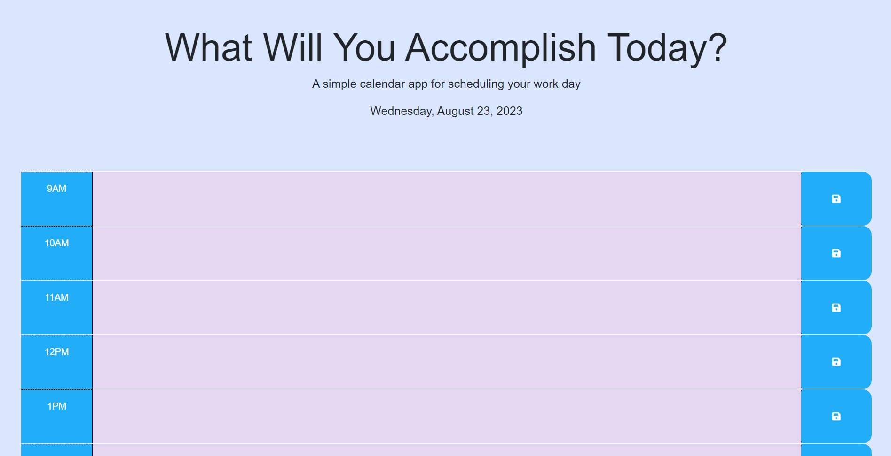

# 05-Hourly-Calendar

## Description
Challenge Project 5 from the University of Minnesota Fullstack Coding Bootcamp

Project 5 focuses on using Third Party API's such as JQuery, Bootstrap, and DayJS. Through this project I learned about the "container-row-column" layout as well as Bootstrap's 12 column layout. I also had the opportunity to learn about DayJS and to see how javascript translates over to JQuery with things such .on instead of .addEventListener and .each instead of a for loop.

## Technologies Used
* Day.js
* JQuery
* Bootstrap

## Screenshot and Link
https://aridel96.github.io/05-Hourly-Calendar/

)

## License
MIT